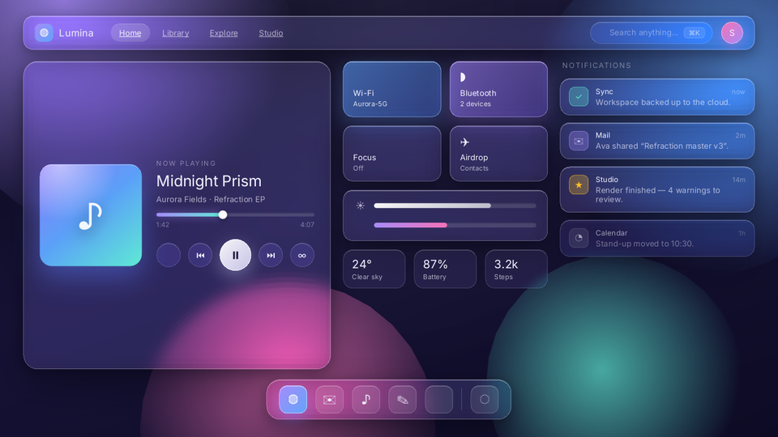
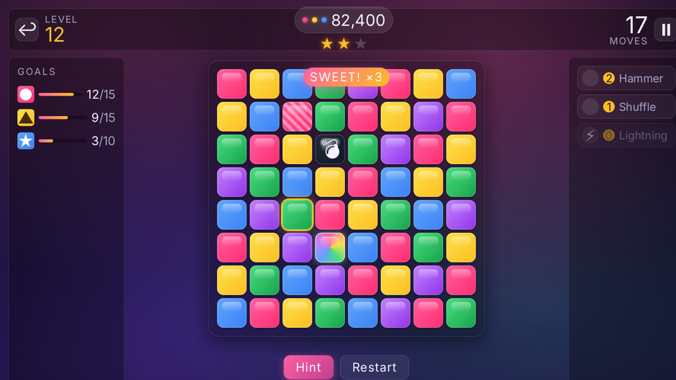
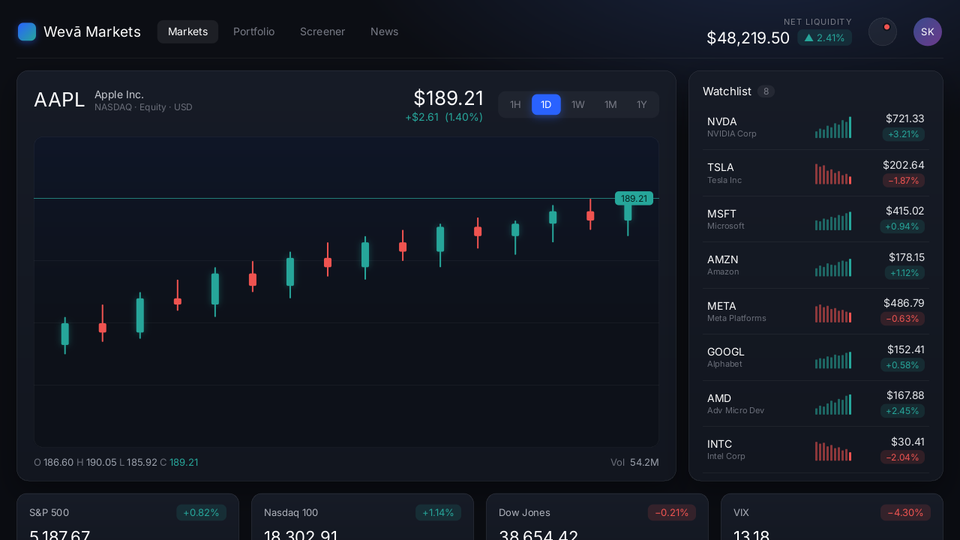
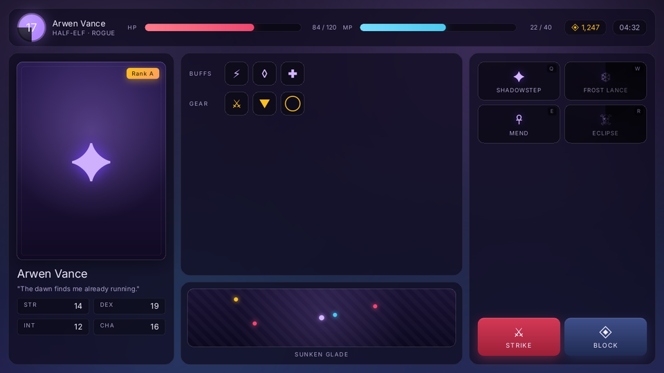

# Weva

HTML and CSS for game UI in **Unity** and **Godot**. Build HUDs, menus and
settings screens, then connect them to C# or GDScript controllers. Both hosts
use the same C++ layout engine, checked against Chrome.

**Development preview.** See [product readiness](docs/PRODUCT_READINESS.md)
for tested configurations, remaining limits and performance evidence.

## Get started

| Host | Requirements | Guide |
|---|---|---|
| Unity | Unity 6000.3+, URP 17, Input System 1.7; Windows x64 native plugin | [Unity setup](Packages/com.wevaui/Documentation~/getting-started.md) |
| Godot | Godot 4.7; Windows/Linux x64 builds | [Addon setup](hosts/godot/ADDON_README.md) |

**Unity:** in Package Manager, choose **Add package from disk** and select
`Packages/com.wevaui/package.json` from this checkout. Follow the setup guide
to enable the URP renderer feature and import the Phase One Demo.
The package's version is 1.0.0; [0.1.x migration notes](Packages/com.wevaui/CHANGELOG.md#migrating-from-01x)
cover its breaking API changes.

**Godot:** extract a packaged addon into your project's root and run
`addons/weva/example/example.tscn`. Check its `build.json` for the included
platforms. To build from source or run the gallery in this checkout, use the
[host build guide](hosts/godot/README.md#building). The
[Frontier Camp example](examples/frontier_camp/README.md) demonstrates a
standalone game integration. Native Godot controls have a
[known text-shaping issue](docs/GODOT_TEXT_SHAPING.md#stock-godot-472-limitation);
the verified configuration uses a patched editor and matching export templates.

## Author UI

Write `.html` and `.css`, bind values with `{{ Name }}` and `data-model`, and
connect actions with attributes such as `on-click="OnStart"`. Hot reload
updates the page while you work.

Weva implements a web subset. Check the [HTML](Packages/com.wevaui/Documentation~/supported-html.md)
and [CSS](Packages/com.wevaui/Documentation~/supported-css.md) references for
supported features and limitations; there is no JavaScript runtime.

- [Unity authoring guide](Packages/com.wevaui/Documentation~/AuthoringGuide.md)
  and [troubleshooting](Packages/com.wevaui/Documentation~/troubleshooting.md).
- [Godot bindings and actions](hosts/godot/ADDON_README.md#connect-a-game-in-three-steps).
- [Documentation index](docs/README.md) for fonts, input, exports and verification.

## Showcase

Pages from [`Assets/UI/`](./Assets/UI/), rendered by the engine (1280×720,
scaled) — plain `.html` and `.css`, no engine-specific markup:

| | |
|---|---|
|  |  |
| `glass.html` — `backdrop-filter`, gradients, layered panels | `match3.html` — grid, badges, shadows |
|  |  |
| `stock-dashboard.html` — flex, tables, sparklines | `hud.html` — bars, cards, an ability grid |

The same engine over a game in Godot: the [western survival
sample](./hosts/godot/project/samples/western_survival/)'s HUD, drawn by the
addon through a `Control` on top of the scene.

## Contribute

The engine is in `libweva/`; hosts translate fonts, input and draw calls.
Unity's package is in `Packages/com.wevaui/`, and the Godot extension is in
`hosts/godot/`.

Read [AGENTS.md](AGENTS.md) before changing the engine or a host.
[AI_REFERENCE.md](AI_REFERENCE.md) orients coding agents;
[architecture](docs/ARCHITECTURE.md) documents the implementation.
`check.sh` runs the local verification gate; the
[latest review](docs/verification/review-three-days-20260915.md) records its
configuration and results. CI configuration alone does not establish platform
or release readiness.

## License

MIT — see [LICENSE.md](LICENSE.md) and
[third-party notices](THIRD_PARTY_NOTICES.md).
