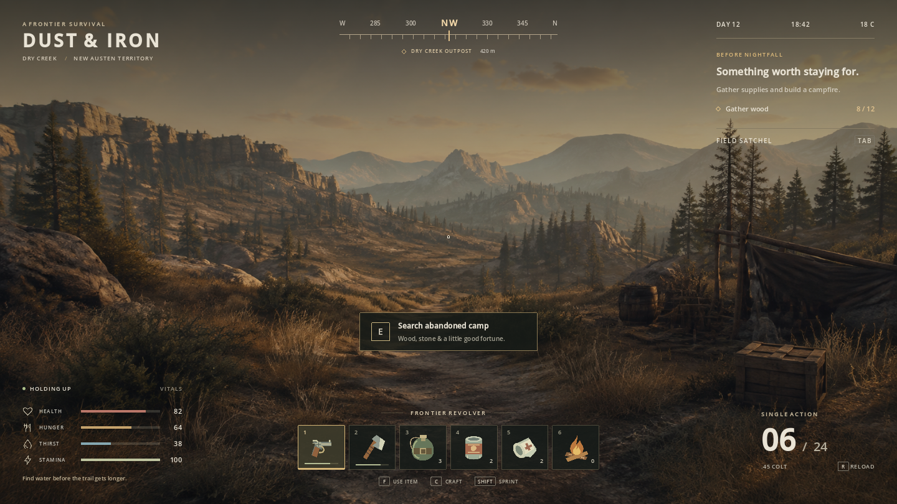
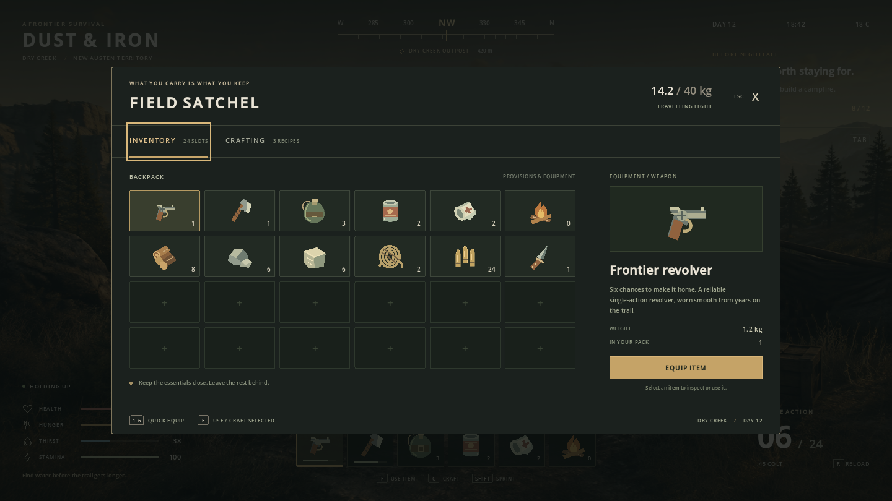

# Dust & Iron

A playable UI sample for a western frontier survival game, rendered by Weva
inside Godot. Charcoal and olive panels, muted brass, a clear central sightline,
and a compact HUD over an illustrated wilderness campsite.



## Try it

Open `hosts/godot/project/project.godot`, select `western-survival` in the
gallery, or open `survival.tscn` and press F6. Import the project once so Godot
discovers the Weva extension and imports the images. From the repository root:

```sh
godot --path hosts/godot/project --resolution 1440x810 --scene res://samples/western_survival/survival.tscn
```

Designed for a desktop viewport of at least 1120 × 720; 1280 × 720 and
1440 × 810 are the main reference sizes. The gallery scales the entire sample,
including its background, when its stage is narrower than 1280 pixels.

| Input | Action |
| --- | --- |
| Tab | Open / close field satchel |
| Escape | Close satchel; the gallery's normal quit shortcut applies when closed |
| C | Open crafting |
| 1–6 or click a hotbar slot | Select held item |
| F | Use held item; use selected inventory item or craft selected recipe while the satchel is open |
| E or click the camp prompt | Scavenge the abandoned camp once |
| Hold Shift | Drain stamina; release to recover |
| Space | Demonstrate firing the selected revolver |
| R | Reload the selected revolver from reserve ammunition |

Try searching the camp, crafting a campfire, closing the satchel, selecting
slot 6 and pressing F. The objective completes and the kit is consumed.
Water restores 25 thirst, beans restore 25 hunger, and bandages restore
20 health. Values cap at 100; using an already-full vital does not waste items.



## Files and integration

- `survival.html` and `survival.css`: the actual UI, with 24 inventory slots,
  six quick slots, three recipes, item details, objectives, notifications,
  survival meters, compass, and ammunition.
- `survival_ui.gd`: sample game state and action handlers. Replace the item
  dictionaries and state values with your game's inventory and player data.
- `survival.tscn`: a standalone Control scene; instance it under your game HUD.
- `assets/`: editable SVG item/status icons and the generated landscape.
- `survival_smoke.gd`: interaction and gallery integration checks.
- `survival_bench.gd`: a repeatable CPU update probe for this sample.
- `image_ui_bench.gd`: a 96-item inventory scroll/fade probe using the item artwork.

The landscape is a static native `TextureRect`, with two native shade overlays.
Replace those with your game's world viewport. The sample does not simulate
movement, combat, terrain placement, saving, or a changing day/night cycle.
Space, Shift and the camp action demonstrate the associated UI state changes.
The compass, time, temperature, waypoint distance and durability marks are
illustrative. Hunger, thirst and health change through item actions; stamina
also changes over time. Reopening the scene or reselecting it in the gallery
resets the sample state.

The inventory DOM is built once. Idle frames do not rewrite it. Stamina writes
only its label and meter width, at most ten times per second, and only when the
displayed integer changes. Discrete actions refresh counts, details and recipe
availability. WevaDocument owns the document update clock; the sample does not
advance it a second time each frame.

The centered interactive panels use CSS layout offsets so their measured and
painted button positions coincide. Button descendants use `pointer-events:none`
so the controller receives the button ID even when its icon or label is clicked.

For a standalone export, select this scene as the main scene, include all sample
assets, and add `*.html,*.css` to the export preset's non-resource inclusion
filter. See the host's desktop export guide for packaging the native extension.

## Verification and runtime cost

On 2026-09-07, the sample passed **56 checks** both headlessly and in the native
Godot 4.7.2 renderer (Compatibility and Forward Mobile), including mouse input
through the gallery. The existing
gallery animation-clock check also passed. Native HUD, inventory, crafting and
notification captures were inspected at 1440 × 810, with HUD and inventory
also inspected at 1280 × 720 and 1120 × 720. No missing assets were reported.

```sh
godot --headless --path hosts/godot/project --script res://samples/western_survival/survival_smoke.gd
godot --path hosts/godot/project --rendering-method gl_compatibility --script res://samples/western_survival/survival_smoke.gd
godot --path hosts/godot/project --rendering-method gl_compatibility --script res://samples/western_survival/survival_bench.gd
godot --path hosts/godot/project --rendering-method gl_compatibility --script res://samples/western_survival/image_ui_bench.gd
```

The probe measures GDScript controller work plus `update_document`, after 60
warm-up frames, over 300 samples per case at a simulated 60 Hz. It does **not**
measure GPU rendering, presentation, complete game frame time, or allocations.
The native runs use Windows on a Ryzen 7 9800X3D and RTX 5080 with Godot 4.7.2's
Compatibility renderer at 1280 × 720. The table reports the median of each
statistic from the earlier three paired runtime60/runtime61 runs, alternating run order.
No builds, tests or profiling instrumentation ran during measurement.

| Case | runtime60 p95 | runtime61 p95 |
| --- | ---: | ---: |
| Idle HUD | 0.009 ms | 0.008 ms |
| Sprinting HUD, all frames | 4.509 ms | 0.772 ms |
| Sprinting HUD, changing frames only | 5.191 ms | 1.547 ms |
| Open inventory, idle | 0.007 ms | 0.007 ms |

Median CPU update across all frames remains 0.005 ms in each case. Each sprint
run contains 39 measured changing frames. Their p95 ranges are 4.971–6.371 ms
before and 1.501–1.577 ms after; the largest individual changing-frame sample
falls from 6.907 ms to 1.695 ms. The earlier single runtime60 measurement was
4.957 ms p95. Paired results show about 70% lower changed-frame p95 CPU cost.

The runtime fix scopes direct-text invalidation and reuses surrounding layout
and paint when the existing geometry proof allows it. It preserves text
wrapping and selector-dependent fallbacks. All 8,393 host checks and the full
47-sample mutation corpus pass, including ASan/UBSan; 11 deterministic native
sample captures match runtime60 exactly. See
[runtime performance](../../../../../docs/RUNTIME_PERFORMANCE.md) for details.

Changing frames still cost considerably more than idle frames. These are CPU
measurements on a fast desktop, not a release-performance guarantee, GPU timing
or results from low-end hardware. Profile the target game's UI budget.

The installed runtime62 also reuses image textures. In three further paired
runtime61/runtime62 runs, the 96-item image inventory's scroll p95 fell from
**3.212 ms to 0.430 ms**, and its panel fade p95 fell from **3.360 ms to
1.097 ms**. Every paired final PNG is identical. These cases change their input
on every measured frame; both use 60 warmup and 300 measured frames. See the
runtime performance document for ranges, validation and binary identifiers.
The full survival HUD's changing-frame p95 improves more modestly in the latest
paired runs: **1.286 ms to 1.025 ms**. Idle median remains 0.005 ms. The earlier
runtime60/runtime61 table above is historical; measurements from separate runs
should not be combined into a single speedup claim.

## Artwork provenance

`assets/frontier.png` was generated with the built-in image-generation tool on
2026-09-07 and copied into this sample. No CLI fallback was used. The SVG icons
were authored as editable code for this sample; their larger intrinsic raster
sizes preserve detail when Godot imports them for the item inspection view.

The same file also sits at `examples/frontier_camp/ui/assets/frontier.png`,
byte for byte. That is deliberate: they are two independent Godot projects and
each needs the texture under its own `res://`. It is not costing what it looks
like — git addresses blobs by content, so both paths resolve to the single
object `13327234`, 2.2 MB packed once, and the second path costs one tree
entry. Deduplicating it would mean a generated copy, a gitignore rule, and a
sample project that is broken until someone runs a script, to save nothing in
the repository and 2.2 MB on disk. Left alone on purpose.

Final landscape prompt:

> Use case: stylized-concept. Asset type: static environment backdrop for a playable sample of a western frontier survival-game HUD, not a picture of UI. A polished realistic in-engine view across a dry creek valley in the American frontier at late golden hour: weathered timber abandoned campsite and small supply crate on the near right, tawny grasses and scrub in foreground, tall distant pine trees, layered rocky mesas and blue-grey mountain ridges, pale warm hazy sky. Eye-level first-person camera, wide landscape 16:9 composition. A winding dusty footpath leads from bottom center into open central valley. Grounded believable environment, cinematic art direction, restrained contrast and muted desaturated olive-brown and amber palette, cool shadowed foreground, atmospheric depth, beautiful natural textures. Keep central sightline open; avoid large focal objects along bottom 20 percent and top 12 percent because the real UI will overlay those areas. Far-off camp is optional visual only, no characters, no hands, no held weapon, no typography, no letters, no logo, no HUD, no borders. Produce one complete high-quality 1920x1080 landscape background.
